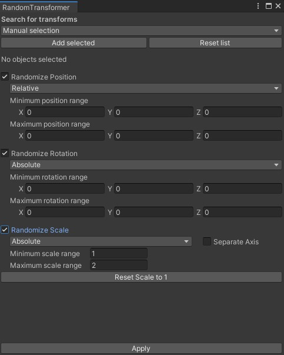
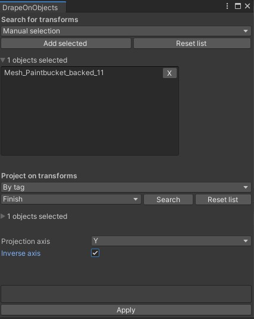
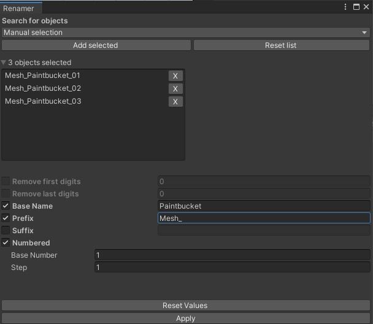
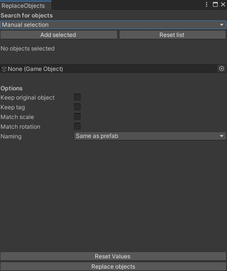
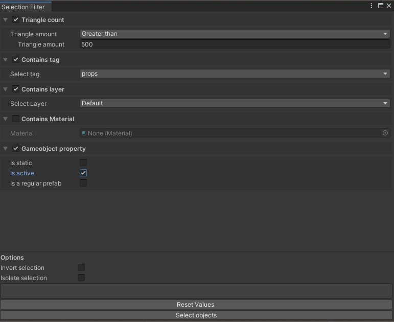
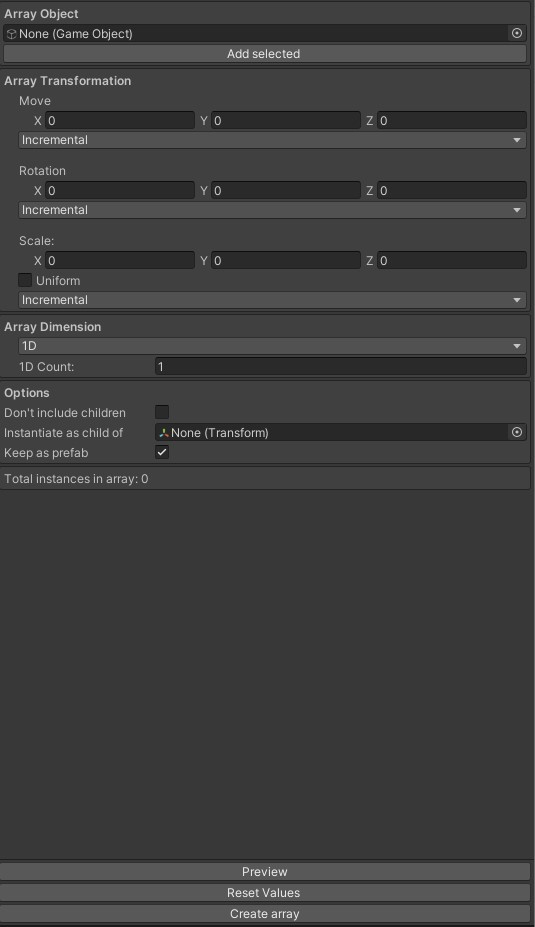

# UnityToolExtensions
A set of tool extensions for Unity 2019 and up. 
Easy to install with the Unity Package Manager. 
All tools are undoable

<H1>Installation</H1>
- Copy the github link https://github.com/anthonyackermans/UnityToolExtensions.git  
- Paste the link in Unity's Package Manager (Package Manager > Add package from Git's URL) 
- You will see "Tool Extensions" in the packages list. Select it and press install. 
- Access the tools via the "tools" in the menu bar

<H1>Tools</H1>
<H2>1 - Randomize transform</H2> 
</img>
Change the position, rotation or scale by random values in specific ranges. 

<H2>2 - Drape object</H2> 
</img>
Move any object in a worldspace axis until it collides with specific objects.  

<H2>3 - Renamer</H2> 
</img>
Batch rename your objects in the scene 

<H2>4 - Replace objects</H2> 
</img>
Replace a selection of objects with a specified object or prefab 

<H2>5 - Selection filter</H2> 
</img>
Select objects in the scene based on a set of filters like triangle count, tag, layer or material 

<H2>6 - Array creator</H2> 
</img>
Create an array of objects in 1, 2 or 3 dimensions. This tool is very similar to the array tool from 3ds max. 
