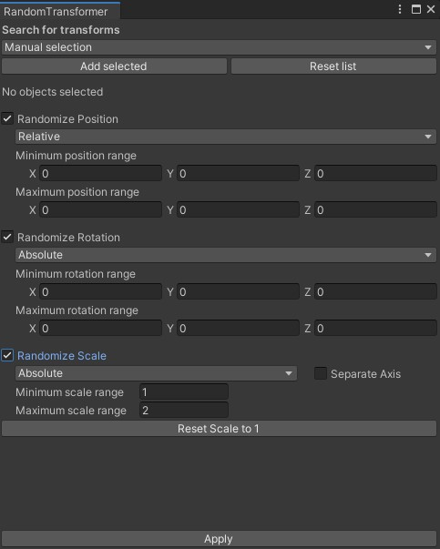
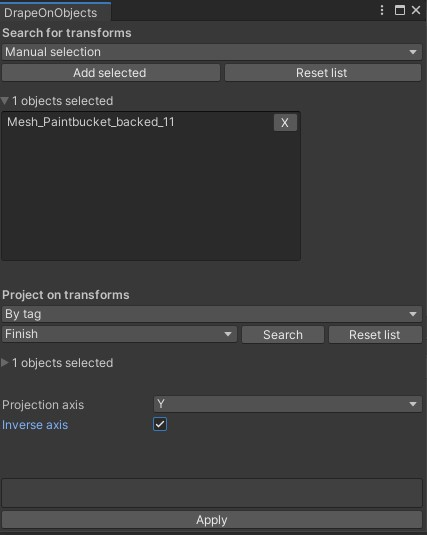
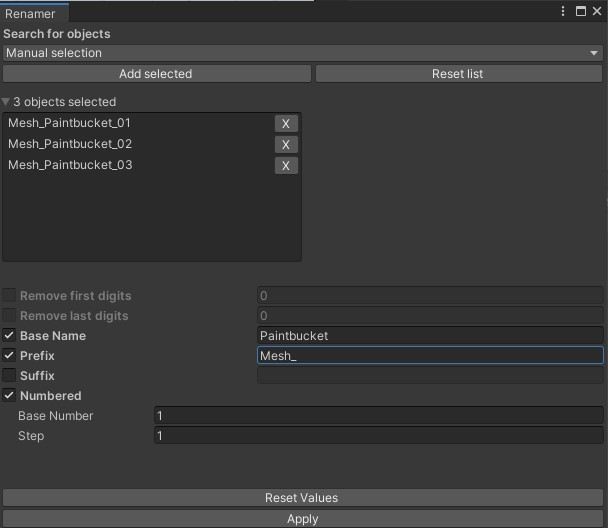

# UnityToolExtensions
A set of tool extensions for the Unity package manager.

<H1>Installation</H1>
- Clone the github link https://github.com/anthonyackermans/UnityToolExtensions.git  
- Paste the link in Unity's Package Manager (Package Manager > Add package from Git's URL) 
- You will see "Tool Extensions" in the packages list. Select it and press install. 

<H1>Tools</H1>
<H2>1 - Randomize transform</H2> 
</img>
Change the position, rotation or scale by random values in specific ranges. 

<H2>2 - Drape object</H2> 
</img>
Move any object in a worldspace axis until it collides with specific objects.  

<H2>3 - Renamer</H2> 
</img>
Batch rename your objects in the scene 
